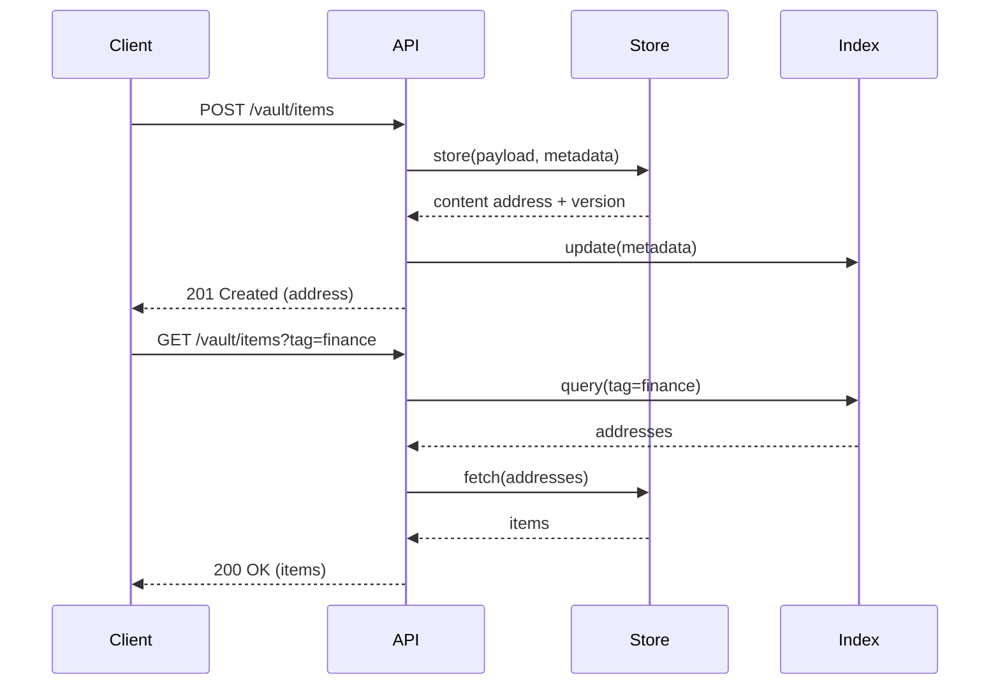

# API Routes

| Method | Path              | Description                              | Request Body                                    | Response |
|--------|-------------------|------------------------------------------|-------------------------------------------------|----------|
| POST   | `/vault/items`    | Stores content and metadata in the vault | `{ "content": "...", "metadata": { ... } }`   | `201 Created` with stored item descriptor |
| GET    | `/vault/items`    | Lists or filters stored items            | Query params matching metadata keys             | `200 OK` with items array |
| GET    | `/vault/history`  | Retrieves change journal entries         | –                                               | `200 OK` with chronological history |
| GET    | `/vault/integrity`| Executes integrity verification          | –                                               | `200 OK` with scan summary |
| GET    | `/vault/config`   | Returns currently loaded configuration   | –                                               | `200 OK` with config payload |

