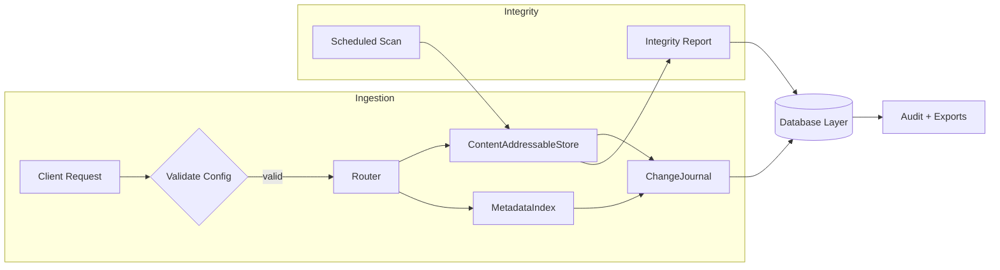

# Operational Flow

1. **Configuration validation** occurs before each write using the event-driven loader.
2. **Storage & indexing** run concurrently to guarantee deduplication and searchable metadata.
3. **Change journal** captures every mutation, feeding the downstream database and audit exports.
4. **Integrity scans** re-hash stored content and report drift back into the same persistence layer.
