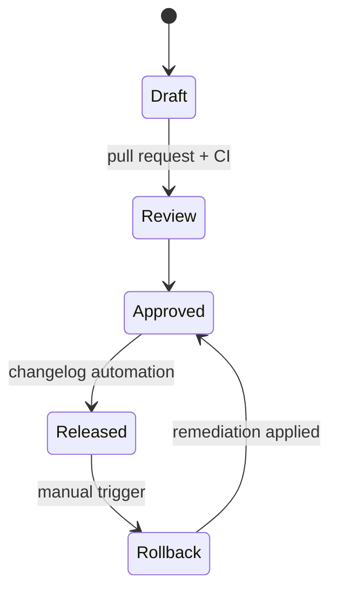

# Configuration Versioning

The configuration system is **event-driven**: each file contains both the target state and
an ordered list of events that describe how that state was produced. When a configuration is
loaded, the loader:

1. Parses JSON or YAML (via the JSON subset) and validates against `schema/config.schema.json`.
2. Registers the version with the in-memory `ConfigRegistry`, capturing the checksum,
   dependencies, and events as structured metadata.
3. Updates `configs/changelog.md` with an audit-friendly entry.

Rollback is achieved by asking the registry for a prior version; the loader emits the
metadata required to reapply the corresponding configuration or replay the events through
external tooling.

## Dependency Tracking

Each configuration declares runtime and service dependencies, enabling deployment automation
and change-risk assessment. The `configs/dependencies.yaml` file provides an aggregate view
across versions.

## Changelog Automation

Run `python scripts/update_config_changelog.py` to refresh the changelog after adding a new
configuration file. The script loads each configuration through the same validation pipeline
used by the API, ensuring no invalid configs are promoted to the changelog.
