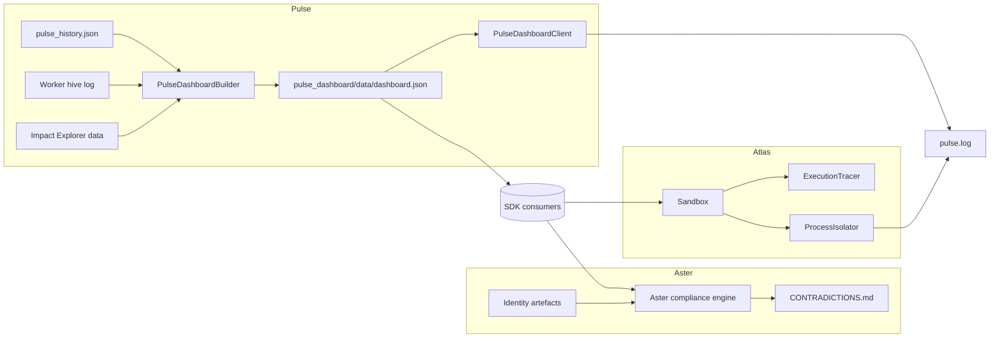

# Echo Architecture Manifest

This manifest captures the newest platform modules powering the Aster, Pulse, and Atlas
subsystems. It consolidates ownership, intent, and integration surfaces so downstream teams
can reason about fixtures, logs, and SDK touchpoints introduced in the latest releases.

## Module overview

| Module | Owner | Purpose | Primary entry points | Key interfaces |
| --- | --- | --- | --- | --- |
| **Aster Compliance Engine** (`compliance/`)| Echo Identity · Aster Core Governance | Normalises charter, trust, and DAO wrapper artifacts then produces compliance reports and fix-it plans.【F:compliance/engine.py†L10-L129】【F:compliance/cli.py†L1-L71】 | `compliance.cli:main`, `Engine.run()` (generates markdown/JSON artifacts under `reports/`).【F:compliance/cli.py†L43-L71】【F:compliance/engine.py†L130-L170】 | `ComplianceContext`, `Finding`, `EngineResult`, schema validators, and rule evaluators consumed by policy tooling.【F:compliance/rules/base.py†L1-L64】【F:compliance/engine.py†L16-L24】 |
| **Pulse Dashboard Suite** (`pulse_dashboard/`)| Echo Pulse Ops Guild | Aggregates pulses, attestations, DNS tokens, worker hive logs, amplify telemetry, and impact data into `dashboard.json`; exposes lightweight client summaries.【F:pulse_dashboard/builder.py†L1-L204】【F:pulse_dashboard/client.py†L1-L105】 | `PulseDashboardBuilder.build()`/`.write()`, CLI `scripts/generate_pulse_dashboard.py`, and `PulseDashboardClient.from_file()` for analytics consumers.【F:pulse_dashboard/builder.py†L38-L77】【F:scripts/generate_pulse_dashboard.py†L1-L40】【F:pulse_dashboard/client.py†L18-L36】 | Impact Explorer + Loop Health collectors, worker hive context manager, JSON payload contract consumed by UI/public data feeds.【F:pulse_dashboard/impact_explorer.py†L1-L126】【F:pulse_dashboard/loop_health.py†L1-L84】【F:pulse_dashboard/worker.py†L1-L112】 |
| **Atlas OS Runtime** (`atlas_os/atlas_runtime/`)| Atlas Platform Lab | Provides deterministic sandbox, isolation, and tracing primitives for executing Atlas instruction programs inside resource envelopes.【F:atlas_os/atlas_runtime/atlas_runtime/sandbox.py†L1-L38】【F:atlas_os/atlas_runtime/atlas_runtime/resource_limits.py†L1-L19】 | `Sandbox.execute()`, `ProcessIsolator.run()`, and `SandboxEnvironment.build()` orchestrated by runtime services and tests.【F:atlas_os/atlas_runtime/atlas_runtime/sandbox.py†L16-L38】【F:atlas_os/atlas_runtime/atlas_runtime/isolation.py†L1-L33】【F:atlas_os/atlas_runtime/atlas_runtime/environment.py†L1-L25】 | Instruction set registry, IO channels, tracing exporters, and resource limit checks reused by Atlas kernel/network subsystems.【F:atlas_os/atlas_runtime/atlas_runtime/instructions.py†L1-L46】【F:atlas_os/atlas_runtime/atlas_runtime/io_channels.py†L1-L35】【F:atlas_os/atlas_runtime/atlas_runtime/tracing.py†L1-L33】 |

### Fixtures and logs mapped to modules

- **Identity charter fixtures** – `identity/aster_charter.md`, `identity/vault_trust_deed.md`, and `identity/orbit_dao_oa.md` feed the compliance parser; cross-links resolve from `identity/crosslinks.json`.【F:identity/aster_charter.md†L1-L53】【F:identity/crosslinks.json†L1-L58】  Sample payloads reside in `identity/samples/` for deterministic validation drills.【F:identity/samples/aster_charter.json†L1-L52】
- **Pulse dataset fixtures** – `tests/fixtures/pulse_dashboard/` contains canonical pulse history, attestation, DNS, amplify, and proof ledgers exercised by builder/client tests.【F:tests/fixtures/pulse_dashboard/pulse_history.json†L1-L43】【F:tests/test_pulse_dashboard_builder.py†L1-L103】  Worker hive telemetry is persisted in `state/pulse_dashboard/worker_events.jsonl` and consumed by both the builder and `WorkerHive` context manager.【F:pulse_dashboard/builder.py†L205-L252】【F:pulse_dashboard/worker.py†L13-L75】
- **Operational logs** – `logs/pulse.log` documents the live Pulse Monitor feed, aligning with dashboard ingestion expectations, while `build/cycles/` artefacts back Loop Health analytics.【F:logs/pulse.log†L1-L10】【F:pulse_dashboard/loop_health.py†L15-L53】  Atlas runtime telemetry is captured through execution traces exported by `ExecutionTracer` for regression analysis.【F:atlas_os/atlas_runtime/atlas_runtime/tracing.py†L1-L33】

## Dependency matrix

| Module | Runtime dependencies | Build/Test dependencies | Source |
| --- | --- | --- | --- |
| Aster Compliance Engine | Python stdlib only (argparse, json, pathlib). | `pytest` via repo default, CLI exercised through Make targets. | `Makefile` targets `validate`, `report`, `site`.【F:Makefile†L17-L30】 |
| Pulse Dashboard Suite | Relies on `web3`, `eth-account`, and ledger helpers from `echo.proof_of_computation` (transitively pulling Ethereum/web3 stack).【F:pulse_dashboard/builder.py†L10-L77】【F:requirements.txt†L15-L47】 | `pytest` suite under `tests/`, LOC tracker script for regression metrics.【F:tests/test_pulse_dashboard_builder.py†L1-L103】【F:docs/pulse_dashboard_loc_report.md†L1-L36】 | `requirements.txt`, Node bridge defined in `package.json` for dashboard feeds.【F:package.json†L5-L20】 |
| Atlas OS Runtime | Core runtime uses stdlib multiprocessing/threading; optional cryptography/protobuf for extended services declared in Atlas OS requirements. | Dedicated tests in `atlas_os/atlas_runtime/tests/` executed via `pytest`. | `atlas_os/requirements.txt`.【F:atlas_os/requirements.txt†L1-L3】【F:atlas_os/atlas_runtime/tests/test_sandbox.py†L1-L80】 |

> Install project extras with `python -m pip install -e .[dev]` to guarantee Pulse and Atlas dependencies resolve consistently across environments.【F:pyproject.toml†L24-L44】

Additional build surfaces:

- Native Atlas support libraries compile via `CMakeLists.txt`, exporting `echo_idmem` and `continuum` used by runtime integrations.【F:CMakeLists.txt†L1-L12】

## SDK alignment & schema findings

| Surface | Reference schema/typing | Alignment notes |
| --- | --- | --- |
| Pulse records (`pulses[]`) | `schemas/pulse.schema.json` / `echo.schemas.pulse.PulseMessage` expect `repo`, `ref`, `kind`, and `signature` fields.【F:schemas/pulse.schema.json†L1-L40】【F:packages/core/src/echo/schemas/pulse.py†L1-L18】 | Dashboard payload supplies `message`, `hash`, `category`, `glyph`, `wave`, and omits signing metadata. Decision: retain lightweight dashboard view but document translation requirement for SDK consumers ingesting signed pulses. |
| Impact Explorer | No dedicated SDK schema; integrates via `PulseDashboardClient` typed accessors. | Client ensures safe defaults and summarisation helpers for UI; no discrepancies noted.【F:pulse_dashboard/client.py†L38-L104】 |
| Atlas runtime traces | `schemas/atlas.schema.json` models node/edge graphs and change logs for published Atlas attestation bundles.【F:schemas/atlas.schema.json†L1-L7】 | Runtime sandbox currently emits stack traces and resource stats only; mapping layer to schema nodes/edges remains pending—flagged for Atlas SDK backlog. |
| Aster artifacts | JSON Charter/Trust/DAO OA validated against local schemas under `compliance/schema/`.【F:compliance/schema_utils.py†L1-L74】 | No external SDK mismatch; validator enforces internal schema parity during `asterc:*` commands. |

## Automated safeguards

- **Unit coverage** – Run `pytest tests/test_pulse_dashboard_builder.py tests/test_pulse_dashboard_client.py` for dashboard regressions and `pytest atlas_os/atlas_runtime/tests` for sandbox guarantees.【F:tests/test_pulse_dashboard_builder.py†L1-L103】【F:atlas_os/atlas_runtime/tests/test_environment.py†L1-L60】
- **Policy validation** – Execute `PYTHONPATH=. python -m compliance.cli asterc:validate identity` before releases to confirm charter/trust drift is detected.【F:compliance/cli.py†L17-L42】
- **Deterministic artefacts** – `PYTHONPATH=. python -m compliance.cli asterc:report identity` regenerates `reports/CONTRADICTIONS.md` to keep version-controlled evidence fresh.【F:compliance/engine.py†L130-L170】
- **Nox automation** – Use `nox -s tests` for aggregate pytest runs and `nox -s compliance` to execute Aster validation within CI (see `noxfile.py`).【F:noxfile.py†L1-L26】

## System graph

Cross-links: consult [Impact Explorer](../impact_explorer.md) for transparency datasets and [`docs/pulse_dashboard_loc_report.md`](../pulse_dashboard_loc_report.md) for LOC tracking guidance.
