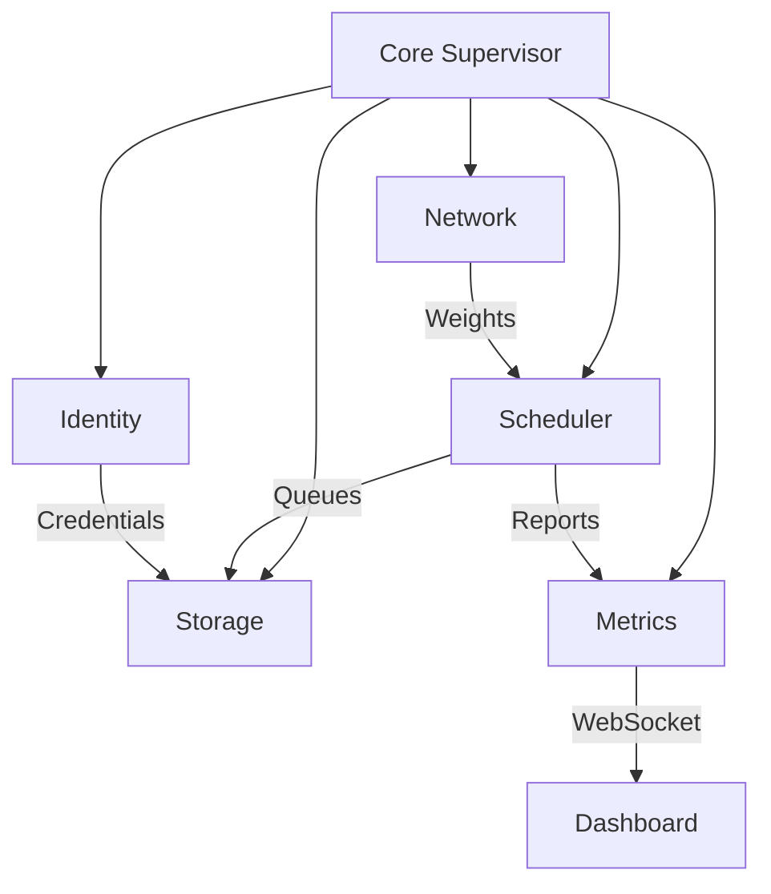

# Atlas OS Architecture

```mermaid
graph TD
  Core[Core Supervisor] --> Scheduler
  Core --> Storage
  Core --> Network
  Core --> Identity
  Core --> Metrics
  Scheduler -->|Queues| Storage
  Scheduler -->|Reports| Metrics
  Network -->|Weights| Scheduler
  Identity -->|Credentials| Storage
  Metrics -->|WebSocket| Dashboard
```

The dashboard consumes the WebSocket feed while auxiliary services interact through the CLI and HTTP APIs.
