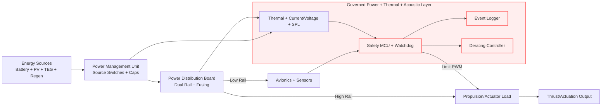
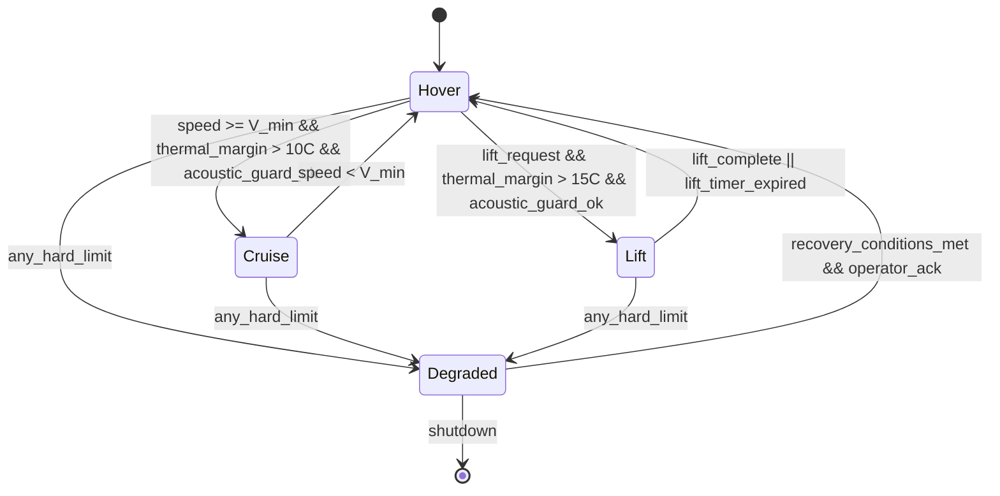
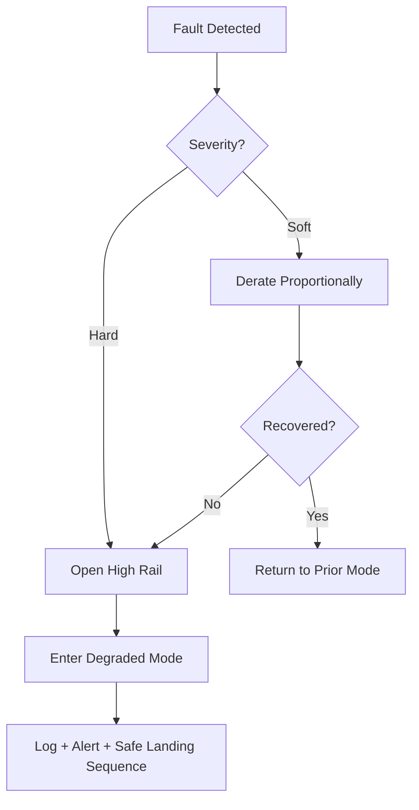

# Echo Fusion Drone — Reference Prototype (Governed Power + Thermal + Acoustic Layer)

## Scope Commitment
This reference prototype focuses on the **Governed Power + Thermal + Acoustic Layer**, providing a buildable, testable subsystem that enforces explicit budgets, mode-dependent power routing, automatic derating, and safe-failure behavior. It validates platform safety claims under real physical, thermal, acoustic, and control constraints.

## Prototype Summary
The prototype is a self-contained **power distribution and governance controller** that sits between energy sources (battery + augmentation sources), loads (propulsion/actuators/sensors), and thermal/acoustic sensors. It enforces constraints defined by the Flight Mode Constitution, logs all transitions and violations, and triggers derating or shutdown when hard limits are exceeded.

**Buildable Reference Implementation (Minimum):**
- **Power board**: Multi-source input (battery + PV/TEG/regen) with dual rail output (high-power rail for propulsion/actuation, low-power rail for avionics).
- **Thermal sensor array**: 4–8 digital sensors placed on battery, ESCs, motor housing, and controller board.
- **Acoustic sensor**: calibrated SPL microphone for ramp/peak monitoring.
- **Control MCU**: safety-rated microcontroller or SBC with watchdog.
- **Derating actuator**: PWM governor controlling max throttle or actuator duty cycle.
- **Logging**: Onboard log storage + stream to ground station.

---

## Architecture Diagram (Energy, Thrust, Control Paths)

---

## Assumptions (Explicit & Falsifiable)
1. **Battery chemistry**: Li-ion or LiPo with rated max continuous discharge (C-rate) per spec.
2. **Thermal sensors**: ±0.5°C accuracy and <1s update rate.
3. **Acoustic sensor**: ±1 dBA accuracy with 10 Hz sampling for ramp detection.
4. **Derating control loop**: Response latency <100 ms.
5. **Heat sinks**: Passive sink area sufficient to maintain steady-state below max temperature at nominal load.
6. **Safe failure**: MCU watchdog can cut high-power rail within 200 ms of fault detection.

---

## Thermal + Acoustic Model (Qualitative + Quantitative)
### Qualitative Model
- Thermal energy from high-power loads accumulates in localized hotspots (ESC/motor housing, battery core).
- Heat flows via conduction to mounts/frames and convection to air.
- Acoustic spikes are driven by sudden ramp rates, load spikes, and unstable flow states.

### Quantitative Model (Simplified)
- **Thermal budget per node**: `T_node_max` (°C)
- **Rate-of-rise constraint**: `dT/dt_max` (°C/s)
- **Acoustic limits**: `SPL_peak <= SPL_mode_max`, `power_ramp_rate <= ramp_mode_max`
- **Critical derating trigger**:
  - If `T_node > T_node_max - 5°C` ⇒ start proportional derate.
  - If `SPL_peak > SPL_mode_max` ⇒ clamp ramp rate + derate.
  - If `T_node >= T_node_max` ⇒ hard throttle clamp to `X%` and log violation.
  - If `T_node >= T_shutdown` ⇒ open high rail and force degraded mode.

---

## Operating Limits (Declared)
- **Battery temperature**: 0–60°C (soft), 65°C (shutdown)
- **ESC temperature**: 0–75°C (soft), 80°C (shutdown)
- **MCU temperature**: 0–70°C (soft), 75°C (shutdown)
- **Peak current**: per battery/ESC spec; must remain < 0.8 × rated continuous
- **Augmentation cap**: ≤15% instantaneous system load and ≤8% mission energy

---

## Failure Modes & Safe Degradation
| Failure Mode | Detection | Safe Degradation Path |
|---|---|---|
| Sensor fault (open/short) | Invalid reading / checksum | Enter **Degraded** mode, clamp power to 30%, log fault |
| Thermal runaway | dT/dt exceeds max | Immediate derating + alert, if persists → shutdown |
| Acoustic limit breach | SPL or ramp rate exceed | Clamp ramp + derate, if persists → degraded |
| Overcurrent | Current > max | Reduce duty cycle, if persists → open high rail |
| MCU watchdog | heartbeat missing | Hard cut to high rail, maintain low rail for logging |
| Power rail sag | Voltage < min | Reduce load, enter **Degraded** mode |
| Source anomaly | reverse current / cap violation | Isolate source, log, degrade if primary affected |

---

## Flight Mode Constitution (Summary)
See `docs/flight_mode_constitution.md` for full invariants. The governance layer enforces:
- **Hover**: strict thermal ceiling, moderate power ramps.
- **Cruise**: balanced thermal budget, sustained duty allowed.
- **Lift**: temporary higher power, but explicit time-bound budget.
- **Degraded**: minimal power, safe landing or hover.

---

## State Machine (Mode Transitions)

**Do-Not-Enter Conditions (Programmatic):**
- `Lift` if thermal margin < 15°C or battery current > 0.8× rated.
- `Cruise` if sustained dT/dt > limit for any node or SPL guard active.
- `Hover` if battery temp >= T_shutdown (force shutdown).

---

## Logged Metrics Schema
| Metric | Type | Sample Rate | Purpose |
|---|---|---|---|
| `mode` | enum | transition | Track state transitions |
| `temp_nodes[]` | float | 1 Hz | Thermal compliance |
| `dT_dt[]` | float | 1 Hz | Thermal runaway detection |
| `spl_peak` | float | 10 Hz | Acoustic compliance |
| `current_high_rail` | float | 5 Hz | Overcurrent detection |
| `voltage_high_rail` | float | 5 Hz | Brownout detection |
| `source_contrib[]` | float | 1 Hz | Power source ledger |
| `derate_level` | float | 1 Hz | Throttle clamp for evidence |
| `violations[]` | enum | event | Governance audit |
| `watchdog_status` | bool | 1 Hz | MCU health |

---

## Failure Tree (Recovery Behaviors)

---

## Test Plan (Validation Evidence)
1. **Thermal Limit Test**: Apply incremental load until soft limits reached. Verify derating curve activates and logs events.
2. **Acoustic Limit Test**: Inject rapid ramp events; verify SPL guard clamps and logs.
3. **Overcurrent Test**: Simulate current spike on high rail. Verify immediate clamp and event log.
4. **Sensor Fault Test**: Disconnect temperature sensor; verify degraded mode entry and logs.
5. **Watchdog Test**: Halt MCU loop; verify high rail cut and low rail logging remains active.
6. **Mode Transition Test**: Trigger transitions hover→cruise→lift→degraded with synthetic inputs; verify constitutional invariants.
7. **Power Cap Test**: Force supplemental sources above cap; verify isolation and logged violation.

---

## Evidence Artifacts Produced
- State transition logs with timestamps.
- Thermal telemetry plots (temp vs time, derate level).
- Acoustic ramp compliance plots.
- Power rail voltage/current traces under load.
- Power source contribution ledger and cap enforcement logs.
- Documented failure and recovery sequence logs.

---

## Build Notes (Minimum Hardware)
- MCU: STM32, ESP32, or similar with watchdog.
- Sensors: TMP117 or equivalent digital temperature sensors.
- Current/Voltage: INA219/INA226 or Hall sensor.
- Acoustic: MEMS microphone + SPL calibration profile.
- Power switch: MOSFET high-side switch with fuse.
- Logging: SD card + serial output.

---

## Compliance with Hard Requirements
- No claims of perpetual motion or energy creation.
- All thrust or endurance effects attributed to known power and thermal management.
- Augmentation sources remain secondary and capped.
- Operating limits, failure modes, and safe degradation paths declared explicitly.
