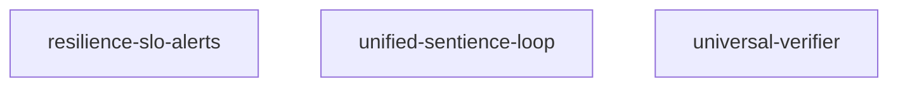

# Service Dependency Graph

The diagram below is automatically generated from the declarative
service specifications in the repository. Dependencies are inferred
by searching for explicit references between services.

_Generated by `scripts/generate_doc_assets.py`._
