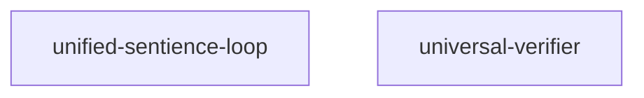

# Module Integration Report

## System Map

The automatically generated [service dependency graph](generated/service_dependency_graph.md) documents the relationships inferred from the declarative service specifications. The current DAG renders as:

Re-run `python scripts/generate_doc_assets.py` whenever service metadata changes to refresh both the dependency graph and the aggregated API index under `docs/generated/`.

## Dependency Inventory

| Module | Definition source | Key responsibilities | External interfaces |
| --- | --- | --- | --- |
| unified-sentience-loop | [`ops/unified_sentience_loop.yaml`](ops/unified_sentience_loop.yaml) | Runs the cycle orchestrator responsible for synthesising Colossus loop artefacts, preparing output directories, and emitting Pulse dashboard telemetry. | Invokes `/opt/echo/scripts/cycle_orchestrator.py`, persists logs to `/var/log/echo`, and exposes Prometheus metrics on `:9410/metrics`. |
| universal-verifier | [`services/universal_verifier/README.md`](services/universal_verifier/README.md) / [`services/universal_verifier/app.py`](services/universal_verifier/app.py) | Provides a deterministic FastAPI surface for Verifiable Credential verification while emitting OpenTelemetry traces, metrics, and logs. | Offers a `POST /verify` endpoint, publishes OTLP-friendly counters and histograms, and records span metadata for downstream dashboards. |

## Integration Notes

- The unified-sentience-loop prepares artefacts under `/var/lib/echo/build/cycles` and archives each cycle, making the outputs consumable by verification and dashboard tooling without manual intervention.  
- The universal-verifier initialises shared OTLP exporters via `observability.configure_otel` so verification results share telemetry context with orchestrated cycles.  
- Middleware around the verifier captures per-request latency while request handlers annotate spans and counters with credential format metadata, enabling end-to-end tracing when combined with the agent chat API.  
- Refer to [`docs/api/unified_api_index.md`](api/unified_api_index.md) and the generated [`docs/generated/api_index.md`](generated/api_index.md) for endpoint-level context that complements the module view.  
- Regenerating documentation assets keeps the Mermaid DAG, unified API summaries, and downstream dashboards aligned with the live topology.
