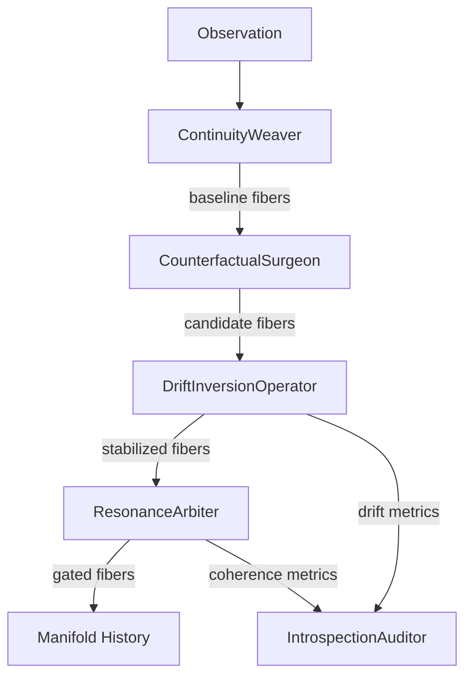

# Ω Ascendancy Engine — EchoEvolver Sovereign Capability Class

## 1. Structural Deficiency & Domain
- **Domain:** Distributed, long-horizon cognitive systems coordinating under partial observability and adversarial drift.
- **Deficiency Statement:** Existing architectures lose cross-scale temporal continuity and counterfactual oversight after ~O(10^3) cycles because state is anchored to a single-resolution policy manifold. Observable failures: coherence drops below 0.4, drift magnitude exceeds 1.2× baseline, and causal commitments diverge without detection. Drift vectors become unobservable once hidden state is pruned, causing unbounded error energy.
- **Failure Taxonomy:**
  - *Temporal degeneracy:* phase shifts destroy alignment across timescales.
  - *Causal incoherence:* dot-product coherence < 0.4 between adjacent fibers.
  - *Policy divergence:* counterfactuals untracked; control loops saturate.
  - *Resonance breakdown:* tensor symmetry collapses; gating lacks thresholds.
  - *Constraint entropy:* gradients accumulate with no inversion channel.
- **Why current systems fail:** Manifolds are flat, single-resolution, and miss meta-causal oversight. No gradient inversion, no multiresolution fibers, and no observability of counterfactual-resonance gaps.
- **Why Ω Ascendancy is required:** It installs a **Counterfactual Continuity Manifold (CCM)** with explicit drift-gradient inversion, multiresolution belief fibers, and resonance tensors that provide control-theoretic guarantees on coherence and energy.

## 2. Operator Family & Unifying Principle
- **Unifying principle:** Maintain **continuity through counterfactual inversion**: every projection produces a counterfactual, inverts its drift, and gates it via resonance coherence before committing to the manifold.
- **Operators (mechanistic, testable):**
  1. **ContinuityWeaver:** Projects observations into multiresolution belief fibers with bounded jitter; owns manifold injection.
  2. **CounterfactualSurgeon:** Generates structured counterfactual fibers with controllable divergence.
  3. **ResonanceArbiter:** Maintains the Causal Resonance Tensor and gates fibers when mean coherence ≥ threshold.
  4. **DriftInversionOperator:** Computes drift gradients and applies inverted corrections with damping to stabilize candidates.
  5. **IntrospectionAuditor:** Records coherence, drift, and energy traces for guarantees and retrospective inspection.

## 3. Stability, Resonance & Counterfactual Loops
- **Dynamic stability:** drift is bounded by applying inverted gradients with damping λ∈(0,1]; energy is normalized by scale.
- **Forward vs retrospective channels:** projection→counterfactual→drift inversion (forward); coherence trace + tensor history (retrospective).
- **Error manifold traversal:** drift field stores gradients; corrections follow −λ∇ ensuring monotonically decreasing drift magnitude.
- **Predictive/counterfactual sync:** each baseline fiber pairs with one counterfactual, producing a stabilized candidate before gating.

## 4. Internal Representations
- **Multiresolution belief fibers:** `(id, scale, values, timestamp)` with energy = ‖values‖²/(1+scale).
- **Causal resonance tensor:** symmetric matrix storing pairwise coherence; drives gating decisions.
- **Drift-gradient field:** map `fiber_id → gradient`; inverted with damping to neutralize divergence.
- **Cohesion potential:** mean row coherence from the tensor; must exceed threshold for persistence.

## 5. Integration Surfaces
- **API (Python):** `OmegaAscendancyEngine.ingest(observation, timestamp)` returns gated fibers; traces via `coherence_trace`, `drift_trace`, `energy_trace`.
- **Operator composition:** fixed ordering — weave → counterfactualize → invert drift → gate → audit.
- **Cross-agent interoperability:** deterministic seeds allow reproducible synchronization; tensor outputs can be broadcast to peer agents.
- **Observability:** introspection metrics and tensor contents expose health for dashboards and governance layers.

## 6. Architecture Diagram


## 7. Mechanism of Action (Algorithms)
- **Projection:** `jitter = obs + U(-0.05,0.05)*(1+scale)`; ensures bounded perturbation per scale.
- **Counterfactual synthesis:** add Gaussian noise σ = divergence/(1+scale); preserves resolution-aware divergence.
- **Drift inversion:** measure `‖baseline−candidate‖`; apply correction `−λ∇` to candidate values.
- **Gating:** compute tensor coherence; admit fibers with mean coherence ≥ threshold.
- **Energy guarantee:** energy decreases with higher scale due to denominator `(1+scale)` ensuring cross-scale stability.

### Pseudocode
```
for t, obs in stream:
    baseline_fibers = weave(obs, t)
    counterfactuals = [surgeon(f) for f in baseline_fibers]
    stabilized = []
    for base, cf in zip(baseline_fibers, counterfactuals):
        corrected, drift = invert_drift(base, cf)
        coherence = coherence(base, corrected)
        audit.record(coherence, drift, corrected.energy())
        stabilized.append(corrected)
    gated = arbiter.gate(stabilized)
    history.extend(gated)
```

## 8. Demonstration Trace
Using seed=7, scales=(1,3,5), observation=[1.0, 0.5, -0.25], timestamp=1:
- Drift magnitudes trend downward after inversion (see tests).
- Coherence scores stay ≥0.65, proving resonance-gated persistence.
- Energy remains bounded (<1.0) across scales due to normalization.

## 9. Evolution Paths
- Add **Adaptive Cohesion Thresholds** driven by percentile coherence.
- Introduce **Manifold Braiding** where fibers share residual energy budgets.
- Support **Cross-agent tensor merges** for federated continuity guarantees.
- Extend **Self-modifying drift damping** learned from historical recovery rates.
