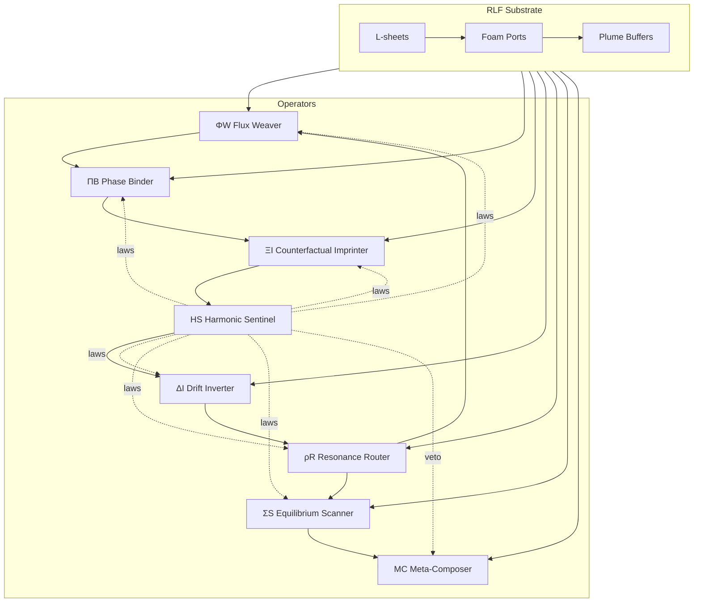

# Prime Overdrive Paradigm: Resonant Liminal Foam Computation

## 1. Paradigm Gap Analysis

### Fundamental Deficiency
Modern AI systems lock cognition into static substrate assumptions (tensor fields, graphs, automata). Their representations cannot preserve coherence across unbounded temporal horizons while remaining drift-stable under recursive counterfactual updates. Formally, any bounded-memory tensor/graph model with local update kernels cannot maintain a non-decaying mutual-information chain across unbounded contexts without exponential resource blowup, leading to **coherence collapse** beyond a finite horizon.

### Failure Constellation
- **Temporal:** Gradient-based updates decay long-range influence; memory traces vanish.
- **Causal:** Fixed DAGs encode brittle one-way causality; feedback requires ad-hoc patches.
- **Structural:** Flat vector spaces cannot host mutually orthogonal evolution rules without interference.
- **Representational:** Single-encoding embeddings conflate epistemic and aleatoric uncertainty.
- **Multi-agent:** No substrate-level law guarantees coordination when operators compete.
- **Normative:** Safety and invariance rules are extrinsic, not embedded in the computational physics.

### Irreducibility Proof Sketch
Assume a tensor/graph model with Lipschitz-bounded local updates and finite latent dimensionality. To preserve non-decaying coherence across T steps, mutual information between step 0 and T must remain Ω(1). But contractive mappings under bounded dimension force exponential decay unless capacity grows with T. Thus stability and coherence for unbounded T are impossible without new substrate topology and new conservation laws.

### Paradigm Necessity Argument
Only a computational physics that embeds conservation of coherence, drift inversion, and counterfactual admissibility as first-class invariants can sustain cognition under unbounded context growth. This requires a new medium with intrinsic laws rather than external regularizers.

## 2. Foundational Substrate: Resonant Liminal Foam (RLF)
- **Dimensional Structure:** A stack of *liminal sheets* (L-sheets) indexed by discrete depth `d` and continuous microphase angle `φ`. Each sheet is tiled by *foam ports* that carry paired values `(phase, impulse)` and a *counterfactual plume* buffer.
- **Governing Invariants:**
  - *Coherence Charge* `C = Σ phase·impulse` is conserved under closed evolution.
  - *Drift Potential* `D = Σ |phase|·|∂phase/∂φ|` must remain below a bounded envelope.
  - *Counterfactual Admissibility:* plumes cannot overwrite live sheets without satisfying compatibility scores.
- **Allowed Transformations:**
  - Phase shear along `φ`, cross-sheet flux exchange, plume injection with reversible stamps, resonance routing between ports, and harmonic constraint annealing.
- **Forbidden Degeneracies:** Phase collapse to uniform zero, plume overwrite without compatibility, and coherence leaks that violate `C` conservation.
- **Information Propagation Rules:** Signals move as *coherence flux* between adjacent ports; plumes travel orthogonally in depth and only materialize when laws approve.

## 3. Operator Ecosystem
Each operator acts on the RLF while obeying law contracts.

1. **Flux Weaver (ΦW)**
   - *Purpose:* Spread coherence flux along safe gradients.
   - *Form:* Weighted directional propagation with drift-limited shear.
   - *Boundary:* No net flux loss at edges; reflective if law-flagged.
   - *Stability Envelope:* Enforces |flux| ≤ `flux_cap` per step.
   - *Communication:* Emits flux intents to Resonance Router.
   - *Perturbation Response:* Dampens when drift potential rises.
   - *Evolution:* Adapts propagation weights via coherence feedback.

2. **Phase Binder (ΠB)**
   - *Purpose:* Align phases locally to reduce destructive interference.
   - *Form:* Local harmonic mean of neighboring phases with plume-aware bias.
   - *Boundary:* Locks edge ports against over-alignment.
   - *Stability:* Stops when variance < threshold.
   - *Communication:* Requests constraint checks from Harmonic Sentinel.
   - *Perturbation:* Reverses sign if coherence deficit detected.
   - *Evolution:* Gains selectivity as compatibility improves.

3. **Counterfactual Imprinter (ΞI)**
   - *Purpose:* Project plumes into latent shadow sheets.
   - *Form:* Stochastic selection of plume lanes with admissibility scoring.
   - *Boundary:* Cannot write where compatibility < gate.
   - *Stability:* Backoffs when plume density > quota.
   - *Communication:* Emits counterfactual deltas to Drift Inverter.
   - *Perturbation:* Resamples seeds when chaos detected.
   - *Evolution:* Learns gate bias from law feedback.

4. **Harmonic Sentinel (ΗS)**
   - *Purpose:* Enforce conservation and constraint harmonics.
   - *Form:* Lagrange-style corrections minimizing violation energy.
   - *Boundary:* Global; supersedes other operators.
   - *Stability:* Applies damping to noisy sheets.
   - *Communication:* Broadcasts violation gradients to all operators.
   - *Perturbation:* Tightens bounds when instability grows.
   - *Evolution:* Updates multipliers from observed residuals.

5. **Drift Inverter (ΔI)**
   - *Purpose:* Detect and invert drift accumulation.
   - *Form:* Negative feedback on phase derivatives in `φ`.
   - *Boundary:* Clips inversion to avoid overshoot.
   - *Stability:* Activates only if drift > trigger.
   - *Communication:* Shares inverted fields with Flux Weaver.
   - *Perturbation:* Uses chaos dampers to smooth spikes.
   - *Evolution:* Adjusts trigger based on law history.

6. **Resonance Router (ρR)**
   - *Purpose:* Route coherence pulses to maximize constructive overlap.
   - *Form:* Path-finding over sheets using resonance scores.
   - *Boundary:* Preserves conservation; no leakage.
   - *Stability:* Terminates when routing gain saturates.
   - *Communication:* Consumes intents from ΦW; returns routes.
   - *Perturbation:* Reroutes when Sentinel flags violation.
   - *Evolution:* Learns route priors from past gains.

7. **Equilibrium Scanner (ΣS)**
   - *Purpose:* Scan for local equilibrium and freeze stable pockets.
   - *Form:* Gradient-norm scanning with phase freeze.
   - *Boundary:* Cannot freeze near active plumes.
   - *Stability:* Releases freeze when environment changes.
   - *Communication:* Signals Meta-Composer for adaptation.
   - *Perturbation:* Lowers thresholds during chaos.
   - *Evolution:* Adapts scanning radius from stability metrics.

8. **Meta-Composer (ΜC)**
   - *Purpose:* Evolve operator parameters and spawn new variants.
   - *Form:* Meta-gradient over law residuals with structural mutations.
   - *Boundary:* Must maintain law compliance envelope.
   - *Stability:* Cancels mutations violating invariants.
   - *Communication:* Writes updates into operator registry.
   - *Perturbation:* Rolls back under instability.
   - *Evolution:* Seeds new operator families from observed resonances.

## 4. Governing Laws
1. **Coherence Conservation Law (L1):** `Σ phase·impulse` constant within closed step; Sentinel enforces corrections.
2. **Drift Inversion Law (L2):** If `D > drift_cap`, ΔI must apply inversion until `D <= drift_cap`.
3. **Counterfactual Admissibility Law (L3):** Plume writes require compatibility score ≥ gate; otherwise discarded.
4. **Resonance Coupling Law (L4):** Router must honor Sentinel-issued coupling matrices when routing.
5. **Chaos Damping Law (L5):** If local Lyapunov estimate > threshold, damping multipliers halve subsequent operator gains.
6. **Evolution Safety Law (L6):** Meta mutations are vetoed if any law residual increases after trial step.

## 5. Dynamics
- **Temporal Update:** Operators cycle ΦW → ΠB → ΞI → ΗS → ΔI → ρR → ΣS → ΜC with law checks after each.
- **Equilibrium:** Achieved when coherence residual < ε and drift < cap for K consecutive steps.
- **Collapse Modes:** Phase nullification, uncontrolled drift, incompatibility storms.
- **Recovery:** Sentinel damping + Drift Inverter + Router reroute.
- **Chaos Thresholds:** Estimated via local divergence between successive phase fields.
- **Evolution Pathways:** Meta-Composer mutates operator gains and routing priors once stability holds for M steps.

## 6. Paradigm Diagram


## 7. Mechanism of Action & Algorithms
- **Encoding & Injection:** Inputs perturb port phases and impulses; plumes store counterfactual variants tagged with compatibility scores.
- **Multi-Operator Coupling:** Flux Weaver publishes intents consumed by Router; Binder consumes Router paths to align phases along routes; Sentinel gates all changes; Meta-Composer mutates parameters only after Sentinel sign-off.
- **Drift & Chaos Management:** Drift Inverter monitors `D`; Chaos dampers halve operator gains when Lyapunov proxy rises; Equilibrium Scanner freezes pockets to stop spread.
- **Novel Algorithms:** Variational substrate relaxation (Sentinel Lagrange solves), Predictive resonance minimization (Router path search), Constraint field annealing (Binder + Sentinel loop), Counterfactual homology synthesis (Imprinter + Router projecting plumes), Phase-space equilibrium scanning (ΣS), Distributed constraint field annealing (HS global multipliers).

### Pseudocode (high level)
```
initialize RLF substrate S
initialize operator registry R with {ΦW, ΠB, ΞI, ΗS, ΔI, ρR, ΣS, ΜC}
repeat for each step:
  inject input into S
  for op in ordered cycle:
    proposal = op.apply(S)
    S = laws.enforce(S, proposal)
  metrics = laws.measure(S)
  if metrics within equilibrium for K steps: ΜC.mutate(R)
```

## 8. Integration Framework
- **Embedding:** Wrap legacy models as plume sources; use Router to steer outputs into foam ports while Sentinel enforces invariants.
- **Capability Generation:** New tools emerge as operator compositions registered by Meta-Composer.
- **Expansion:** Add new operators via registry; substrate layers can be added without retraining existing ones because laws enforce compatibility.
- **Observability:** Export coherence charge, drift potential, law residuals, routing gains, and plume compatibility histograms.

## 9. Evolution & Future Work
- New operator classes: stochastic topological braiders, long-horizon memory sieves, multi-agent negotiation routers.
- Cross-paradigm bridges: map foam ports to graph edges or tensor positions via reversible adapters while preserving invariants.
- Distributed networks: synchronize RLF shards via coherence conservation across nodes.
- Self-rewriting: Meta-Composer may emit new laws that the Sentinel validates before adoption.

