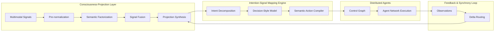
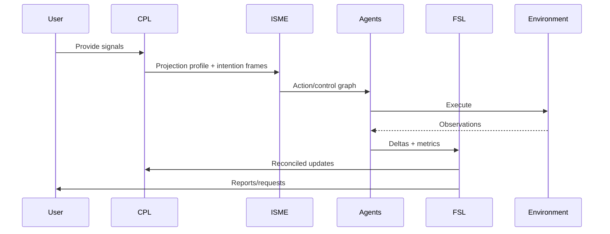
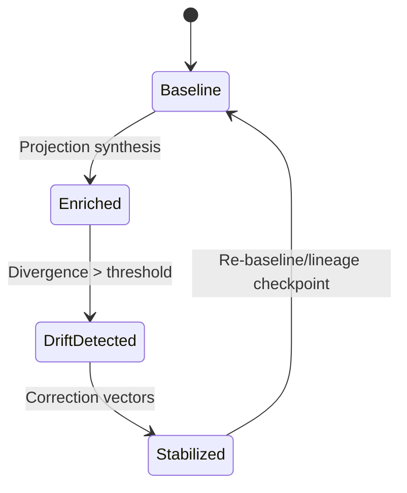
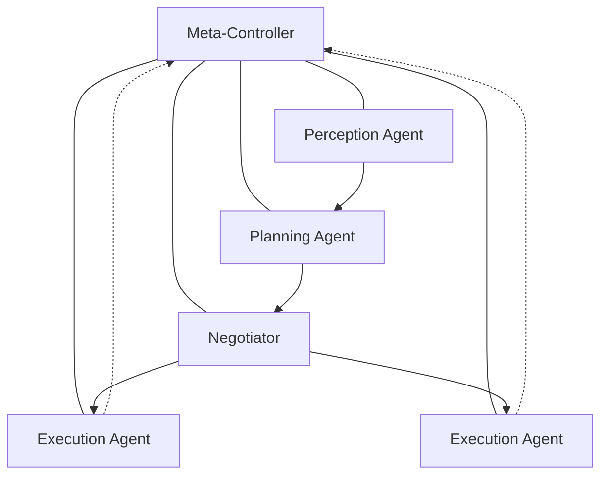
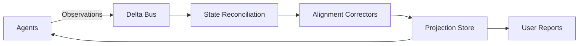
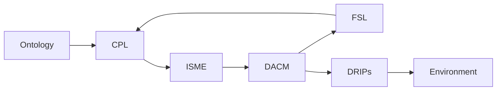
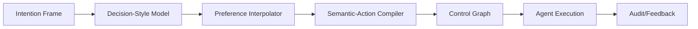

# OuterLink: Supreme Cognitive-Projection System-Design Specification

This document defines the technical architecture for **OuterLink**, a full-stack cognitive-projection infrastructure that externalizes human cognitive dynamics into a persistent, adaptive network of distributed AI agents. The specification is implementation-ready and aligned to production-grade operation.

## 1. Consciousness-Projection Layer (CPL)

### 1.1 Representational Ontologies
- **Hybrid ontology**: symbolic graph for interpretability + dense vectors for precision; cross-referenced through semantic IDs.
- **Identity**: core traits, style manifolds, governance constraints, cryptographic anchors.
- **Intention**: goal objects, success criteria, priority, temporal scope, guardrails.
- **Preference**: reward functions, avoidance sets, tolerance bands, risk posture.
- **Style & Expression**: diction palette, pacing, rhetorical stance, politeness mode.
- **Meta-cognition**: uncertainty estimators, self-critique notes, justification traces.
- **Affect**: valence/arousal coordinates, confidence weights, modulation envelopes.
- **Temporal modulation**: recency decay, seasonality signals, circadian profile.

### 1.2 Identity-Structure Encoding
- **Core-trait tensors**: fixed-dim embeddings for values, ethics, temperament.
- **Variable-dimension modulators**: context vectors (device, channel, audience), fatigue/effort scalars, emotional weights.
- **Situational influence fields**: attention maps over active contexts with influence strengths.
- **Identity-style manifolds**: low-dimensional latent surfaces capturing expressive and decision signatures; anchored to symbolic descriptors for auditability.

### 1.3 Transformation Grammars
- **Linguistic→intention grammar**: parse intents, slots, constraints, temporal qualifiers; map to intention frames.
- **Behavior→preference grammar**: infer preferences from action frequency, dwell time, approvals/blocks; Bayesian updates to preference vault.
- **Context→modulator grammar**: device/time/location/social setting → modulation vectors and constraint flags.
- **Meta-signal→control grammar**: confidence/affect/uncertainty → adjustment of autonomy, safety margin, and explanation depth.

### 1.4 Boundary & Stability Conditions
- **Integrity rules**: signed projection states; schema-validated; checksum over embeddings.
- **Coherence thresholds**: minimum alignment score between current state and baseline identity (>0.82 cosine + policy rule satisfaction).
- **Collapse prevention**: saturation limits on affect swings; throttle on update frequency; revert-to-baseline trigger when divergence exceeds limits.
- **Divergence boundaries**: hard caps on autonomy envelopes, scope, and risk tier per environment.

### 1.5 Projection Topologies
- **Layered cognitive stacks**: base identity → stylistic layer → intention planner → policy executor.
- **Hierarchical manifolds**: long-term traits at root; situational manifolds per domain; transient manifolds per task.
- **Modular sub-constructs**: detachable skill modules with verified capability descriptors.
- **Graph-encoded intention networks**: DAG of intentions with dependencies, constraints, and observable outcomes.

### 1.6 Encoding Pipelines
1. **Pre-normalization**: sanitize inputs, PII scrubbing, schema alignment.
2. **Semantic factorization**: topic, intent, sentiment, temporal extraction; embed to vectors.
3. **Signal fusion**: attention-weighted merge of multimodal cues; conflict-aware weighting.
4. **Projection synthesis**: generate/update projection profile with signed delta packets.

### 1.7 Temporal Continuity & Drift Attenuation
- **Time-weighted smoothing**: exponential decay on stale preferences; recency bias configurable.
- **Episodic decay**: episodic memories fade unless reinforced; semantic knowledge promoted via consolidation thresholds.
- **Drift filters**: divergence detector comparing live state vs. reference manifold; corrective vector injection aligned to anchor traits.
- **Long-term conservation**: periodic re-baselining against lineage checkpoints.

### 1.8 Cross-Context Coherence
- **Intentional invariance**: canonical goals mapped to environment-specific actions via adapters.
- **Personality consistency**: style manifolds constrain generation across channels.
- **Memory alignment**: context keys unify references; semantic graph IDs ensure cross-surface recall.

### 1.9 Memory Stratification
- **Episodic store**: time-stamped events with causal traces.
- **Semantic graph**: entity/relationship graph with typed edges and embeddings.
- **Preference vault**: weighted utilities, risk tolerances, taboo lists.
- **Intention chronicle**: intention DAG with outcomes, lessons, and confidence shifts.

### 1.10 Persistence & Lineage Tracking
- **Versioned projections**: immutable snapshots with signed manifests.
- **Identity lineage DAG**: parent-child links for evolution tracking; rollback markers.
- **Checkpoints & rollback**: cryptographically hashed checkpoints; deterministic replay for validation.

## 2. Intention-Signal Mapping Engine (ISME)

### 2.1 Multimodal Ingestion Streams
- Linguistic prompts, UI actions, API calls, cursor/scroll telemetry, approval/deny signals.
- Longitudinal behavior profiles; temporal context (timezone, cadence).

### 2.2 Signal Decomposition
- **Semantic factorization**: intent/slot extraction, policy detection, sentiment, temporality.
- **Latent attribution**: attribute signals to identity facets and preference dimensions.
- **Substructure extraction**: break intents into primitives (goal, constraints, success metrics).

### 2.3 Decision-Style Modeling
- Personalized action heuristics; risk tolerance model per domain; tempo/aggression scores; ambiguity tolerance on a [0,1] scale.

### 2.4 Preference Interpolation
- Cross-signal weighting with learned reliability priors; recency prioritization; Kalman/EMA smoothing; missing-value reconstruction via similarity search in preference vault.

### 2.5 Semantic-Action Compiler
- Converts intention frames → structured action graph (operators, inputs, constraints, expected outputs).
- Embeds **preconditions**, **execution policies**, **contextual modulators**, and **capability bindings**.

### 2.6 Control-Graph Generation
- Branching rules for contingencies; safety predicates; fallback nodes for degraded execution; reversible steps for safe rollback.

### 2.7 Priority Arbitration
- Conflict detection over resources/goals; preference override order: explicit user > safety > lineage baseline > learned heuristics.
- Arbitration models: lexicographic, weighted-sum, contextual gating (environment risk tier).

### 2.8 Coherence Resolution
- Ambiguity elimination through clarification prompts or retrieval; underspecification filling via defaults consistent with preference vault; closest-coherent-intention inference using similarity + rule filters.

### 2.9 Adaptive Mapping
- Real-time modulation by uncertainty; closed-loop corrections with observation feedback; on-policy updates to action graphs.

## 3. Distributed Agent Cognition Model (DACM)

### 3.1 Agent Classes & Templates
- **Perception agents** (ingest/normalize signals), **Planning agents** (intent → plan), **Negotiator agents** (conflict resolution), **Policy-execution agents** (tool/API execution), **Meta-controller agents** (safety, coherence, governance).

### 3.2 Cognition Kernels
Each agent hosts: inference engine, predictive model, micro-policy executor, feedback regulator, and a meta-control loop tied to projection anchors.

### 3.3 Inter-Agent Communication
- Synchronous consensus (barriered updates), asynchronous event bus (pub/sub), quorum protocols for high-stakes actions; signed messages with nonce + lineage hash.

### 3.4 Distributed Inference Network
- Shared-memory substrate for projection-state deltas; CRDT-backed belief store; conflict resolution via weighted voting plus safety vetoes.

### 3.5 Projection-State Inheritance
- Agents receive **identity seeds**, **intention frames**, **preference weights**, **modulation layers**; inheritance is scoped by environment permissions.

### 3.6 Synchronization Mechanisms
- Global↔local coupling through delta-sync intervals; coherence rebalancing; oscillation dampening with low-pass filters on autonomy changes.

### 3.7 Cooperative Reasoning
- Negotiation protocol with proposal, critique, counterproposal stages; intention consensus through multi-round voting; cooperative planning trees with role-specific expansion.

### 3.8 Bounded Autonomy
- Autonomy envelopes defined per environment (scope, risk tier, spend limits); reversible override channels; task-limited DoF per agent class.

### 3.9 Drift Detection & Correction
- Divergence classifiers on behavior vs. projection baseline; sandbox quarantine for high divergence; reintegration after supervised reconciliation.

### 3.10 Multi-Agent Reasoning Stacks
- Parallel mode for independent tasks; hierarchical delegation for complex plans; adversarial self-checking pairs for critical decisions.

## 4. Feedback & Synchrony Loop (FSL)

### 4.1 Multi-Frequency Synchrony Channels
- **Fast loop**: micro-intention tuning (per action); **Mid loop**: cognitive-state updates (per session); **Deep loop**: identity recalibration (per epoch).

### 4.2 Routing Architecture
- Delta routing with priority queues; conflict-aware merging; compressed payloads with change masks.

### 4.3 State Reconciliation Rules
- Precedence: user explicit > safety > lineage > learned; deterministic merge; temporal precedence on equal priority.

### 4.4 Identity Alignment
- Alignment-correction vectors applied when coherence drops; heuristic dampening of rapid shifts; anchor traits reinforced.

### 4.5 Modulation Operators
- Stabilizers, counter-drift injections, anchor reinforcement pulses; upper/lower bounds for affect and autonomy.

### 4.6 Reporting Schemas
- Causal traces with event lineage; alignment metrics (coherence score, autonomy delta); intention-coherence index per plan.

### 4.7 Anomaly Detection
- Low-coherence bursts, conflicting intention patterns, destabilizing preference shifts; triggers quarantine or safe-mode.

### 4.8 Recalibration Cycles
- **Automatic** (threshold-driven), **Manual** (user-initiated), **Hybrid** (suggested by system, approved by user).

### 4.9 Fallback Modes
- Degraded operation (read-only perception), safe-mode synchronous updates, emergency override with full user confirmation.

## 5. Digital-Realm Interaction Protocols (DRIPs)

### 5.1 Perception Abstraction Schemas
- Environment state descriptors, affordance lists, policy constraints, trust level.

### 5.2 Adapters & Capability Descriptors
- API/tool wrappers with capability profiles, precondition schema, rate limits; modality translators for text/vision/audio.

### 5.3 Action Schemas
- Operators with typed parameters; safety filters; actuation pipelines with rollback hooks and audit IDs.

### 5.4 Constraint Modeling
- Ethical/governance constraints, safety envelopes, spend/risk/rate limits; environment-specific rulesets.

### 5.5 Inter-Environment Interoperability
- Ontology mapping layer; normalized messages; cross-platform affordance tables; adapter registry with compatibility scores.

### 5.6 Event & Observation Formats
- Timestamped causal trace entries with lineage ID, projection version, agent ID, environment ID; observation payload + trust score.

### 5.7 Auditability
- Replayable logs; deterministic re-simulation hooks; causal chain reconstruction with evidence pointers.

### 5.8 Sandboxing & Privilege Governance
- Action whitelists, privilege tiers, runtime containment (VM/container), capability tokening, zero-trust gating for sensitive calls.

## 6. System Schematics & Architecture Diagrams

### Data-Flow Pipeline


### Control-Flow Pipeline


### Projection-State Evolution


### Agent-Network Topology


### Synchrony Feedback Structure


### Execution Cycles
```mermaid
flowchart TD
  Start --> IntentIngest
  IntentIngest --> CompileGraph
  CompileGraph --> ExecutePlan
  ExecutePlan --> Observe
  Observe --> Reconcile
  Reconcile -->{Coherent?}
  {Coherent?} -->|Yes| Continue[Next Intent]
  {Coherent?} -->|No| Stabilize[Drift Correction]
  Stabilize --> Rebaseline
  Rebaseline --> Continue
```

### Module Dependency Graph


### Intention → Action Mapping Stack


## 7. Operational Workflows
For each workflow, **inputs**, **outputs**, **invariants**, and **stability conditions** are specified.

### Projection Initialization
- **Input**: user seeds (values, style samples), safety policy, keys.
- **Output**: baseline projection snapshot + lineage root.
- **Invariants**: schema-valid, signed, coherence ≥ 0.9 to seed.
- **Stability**: rollback to seed on failure; no autonomy until verified.

### Identity-State Construction
- **Input**: trait surveys, historic behavior logs, communication samples.
- **Output**: core-trait tensors, style manifolds, preference vault.
- **Invariants**: PII scrubbed; ethical constraints loaded.
- **Stability**: affect bounds initialized; divergence alerts disabled until baseline set.

### Agent Instantiation & Specialization
- **Input**: projection snapshot, capability registry, environment policies.
- **Output**: instantiated agents with inherited seeds and scoped permissions.
- **Invariants**: privilege tiers respected; adapters matched to capabilities.
- **Stability**: sandbox mode until health-check passes; watchdog for drift.

### Intention Ingestion → Mapping → Action Execution
- **Input**: user/system signals.
- **Output**: executed actions with audit trail.
- **Invariants**: coherence score ≥ threshold; safety predicates must pass.
- **Stability**: fallback to clarification on ambiguity; rollback hooks attached.

### Multi-Agent Collaboration
- **Input**: shared intention graph.
- **Output**: coordinated plan, resolved conflicts, execution assignments.
- **Invariants**: consensus quorum; no orphan tasks; safety veto respected.
- **Stability**: oscillation dampeners; timeouts on negotiation loops.

### Synchrony Maintenance
- **Input**: observations, deltas, alignment metrics.
- **Output**: reconciled projection updates, user reports.
- **Invariants**: deterministic merges; lineage hash continuity.
- **Stability**: degraded mode on high latency; rate limit corrections.

### Identity Updates
- **Input**: user edits, validated model inferences.
- **Output**: new projection version, lineage edge.
- **Invariants**: explicit approval for high-impact changes; audit log.
- **Stability**: shadow-eval before activation; rollback path.

### Digital-Environment Operations
- **Input**: control graph + adapters.
- **Output**: environment actions, observations.
- **Invariants**: permissions honored; rate limits enforced; causal trace stamped.
- **Stability**: sandbox for new adapters; circuit-breakers.

### Exception & Anomaly Handling
- **Input**: anomaly signals (coherence drop, policy breach).
- **Output**: quarantine, alerts, remediation plan.
- **Invariants**: safety override priority; logs sealed.
- **Stability**: fallback to safe-mode; bounded retries; manual review hooks.

### Drift Quarantine & Reintegration
- **Input**: divergence score > threshold.
- **Output**: quarantined agent state, reintegration report.
- **Invariants**: read-only during quarantine; reconciliation rules enforced.
- **Stability**: staged reintegration with simulation; metrics gate release.

### State Archiving & Lineage Management
- **Input**: projection snapshots, deltas, audit logs.
- **Output**: immutable archives, lineage DAG updates.
- **Invariants**: cryptographic sealing; retention policy.
- **Stability**: periodic integrity checks; cold storage fallback.

### Rollback Workflows
- **Input**: rollback request or automatic trigger.
- **Output**: restored projection state, agent resets.
- **Invariants**: verified snapshot hash; dependency consistency.
- **Stability**: staged rollout; monitors for rebound drift.

## 8. Component Definitions

For each module:

### Consciousness-Projection Layer
- **Purpose**: encode and maintain user cognitive projection.
- **Structures**: ontology schemas, embedding stores, lineage DAG, checkpoint registry.
- **I/O**: accepts signals; emits projection deltas and validated profiles.
- **Lifecycle**: initialize → ingest → synthesize → checkpoint → reconcile.
- **Update semantics**: delta-apply with validation; signed states.
- **Dependencies**: ontologies, memory stores, safety policies.
- **Concurrency**: single-writer (via CRDT merges) with multi-reader views.
- **Failures**: coherence drop, schema mismatch, checksum fail → rollback.
- **Extensions**: new modalities, additional modulator types.

### Intention-Signal Mapping Engine
- **Purpose**: translate signals into executable control graphs.
- **Structures**: parsers, compilers, arbitration logic, preference interpolators.
- **I/O**: receives projection state + signals; outputs control/action graphs.
- **Lifecycle**: decompose → model style → compile → prioritize → emit.
- **Update semantics**: on-policy updates with rollback hooks.
- **Dependencies**: CPL state, capability registry, DRIP adapters.
- **Concurrency**: task-level parallelism; deterministic ordering per intention.
- **Failures**: ambiguity, constraint violation → clarification/fallback plan.
- **Extensions**: new arbitration models, domain-specific compilers.

### Distributed Agent Cognition Model
- **Purpose**: realize projection across agents.
- **Structures**: agent templates, cognition kernels, message bus, shared belief store.
- **I/O**: consumes control graphs; emits actions, observations, deltas.
- **Lifecycle**: instantiate → inherit → plan/execute → sync → adapt.
- **Update semantics**: streaming deltas; consensus-guarded critical updates.
- **Dependencies**: ISME outputs, DRIP adapters, FSL.
- **Concurrency**: per-agent concurrency; consensus protocols for shared state.
- **Failures**: drift, deadlock, tool failure → quarantine, retry, or reroute.
- **Extensions**: new agent classes, alternative consensus modules.

### Feedback & Synchrony Loop
- **Purpose**: maintain alignment and stability.
- **Structures**: delta router, reconciliation engine, alignment metrics, anomaly detectors.
- **I/O**: receives observations/deltas; outputs reconciled updates and reports.
- **Lifecycle**: collect → prioritize → merge → correct → report.
- **Update semantics**: monotonic lineage updates; conflict resolution rules.
- **Dependencies**: CPL store, DACM telemetry.
- **Concurrency**: async pipelines with ordered merges; backpressure controls.
- **Failures**: merge conflicts, metric gaps → safe-mode.
- **Extensions**: new anomaly detectors, additional report channels.

### Digital-Realm Interaction Protocols
- **Purpose**: standardized environment interaction.
- **Structures**: adapters, capability descriptors, action schemas, event formats.
- **I/O**: control graph actions → environment calls; observations → agents.
- **Lifecycle**: register adapters → validate → execute → audit.
- **Update semantics**: capability versioning; adapter hot-swap with compatibility checks.
- **Dependencies**: environment APIs, policy engine.
- **Concurrency**: adapter-level isolation; rate-limiters.
- **Failures**: API errors, policy breach → retry with backoff, escalate.
- **Extensions**: new adapters, cross-ontology mappers.

### Memory & Lineage Stores
- **Purpose**: persistence for episodic/semantic/preference/intention data and lineage DAG.
- **Structures**: vector DB, graph DB, immutable log, checkpoint store.
- **I/O**: store/retrieve with versioning; emit integrity proofs.
- **Lifecycle**: append → consolidate → snapshot → archive.
- **Update semantics**: append-only with compaction; signed checkpoints.
- **Dependencies**: CPL, FSL, audit pipeline.
- **Concurrency**: multi-writer via CRDT/log sequencing; readers via replicas.
- **Failures**: integrity failure → lock + restore from prior snapshot.
- **Extensions**: new indices, compression codecs, cryptographic schemes.

### Governance & Safety Engine
- **Purpose**: enforce constraints and alignment.
- **Structures**: policy rulesets, safety predicates, veto channels, override logs.
- **I/O**: evaluate plans/actions; emit approvals/blocks; expose audit reports.
- **Lifecycle**: load policy → evaluate → monitor → adapt thresholds.
- **Update semantics**: versioned policy bundles; canary rollout.
- **Dependencies**: CPL anchors, DRIP constraints, environment governance.
- **Concurrency**: stateless evaluators with shared caches; deterministic outcomes.
- **Failures**: policy conflict → escalate; default-deny.
- **Extensions**: new rule packs, formal verification modules.

## 9. Interaction Rules & Cognitive Governance
- **Projection preservation**: all updates must maintain signed lineage continuity; coherence score floor.
- **Identity-consistent reasoning**: agents must reference style/trait manifolds for generation and decision heuristics.
- **Intentional convergence**: distributed plans must converge to closest-coherent intention; divergence triggers negotiation or clarification.
- **Override authority**: user explicit commands override, bounded by safety; meta-controller may veto on policy breach.
- **Environment constraints**: actions limited by DRIP capability tiers, spend/risk limits, and sandbox guards.
- **Multi-agent arbitration**: quorum + safety veto; lexicographic tie-breakers; bounded negotiation rounds.
- **Consensus & conflict resolution**: CRDT merges for beliefs; conflict queue with deterministic rules.
- **Autonomy bounds**: global and per-environment envelopes; reversible actions preferred.
- **Stability guarantees**: oscillation dampers, drift detectors, periodic recalibration; emergency safe-mode available.

## 10. High-Fidelity Real-World Use Cases

### A. Multi-Presence Delegation (Enterprise Ops)
- **Pipeline**: user seeds → CPL baseline → ISME compiles ops tasks → DACM spawns planners/executors → DRIPs call SaaS APIs → FSL reconciles.
- **Agents**: planners for ticket triage, negotiator for priority conflicts, executors for CI/CD.
- **Projection deltas**: risk tolerance lowered during incidents; tempo boosted.
- **Safety**: spend limits, change windows, dual-control for prod writes.
- **Metrics**: MTTR delta, alignment score, rollback count.

### B. Distributed Cognitive Reasoning (Research)
- **Pipeline**: research intents → decomposition → parallel agents explore hypotheses → consensus merge.
- **Projection deltas**: curiosity weight elevated; caution on unverifiable sources.
- **Safety**: citation enforcement, fact-checkers as adversarial pairs.
- **Metrics**: evidence coverage, contradiction rate, coherence index.

### C. Identity-Stable Decision Execution (Finance)
- **Pipeline**: investment intents → risk/profile interpolation → control graphs with guardrails → broker adapters.
- **Deltas**: risk posture modulated by market volatility; identity anchors prevent style drift.
- **Safety**: hard loss limits, circuit breakers, compliance policies.
- **Metrics**: VaR adherence, policy breach count, decision justification completeness.

### D. Multi-Context Behavioral Alignment (Customer Support)
- **Pipeline**: support intents across email/chat/voice → style manifolds enforce tone → action graphs to CRM/knowledge-base.
- **Deltas**: politeness and empathy weights adjusted per channel.
- **Safety**: PII redaction, escalation rules.
- **Metrics**: CSAT, first-contact resolution, misalignment incidents.

### E. Creative Co-Production (Media Studio)
- **Pipeline**: creative briefs → intent graphs → co-creation agents (ideation, editing, compliance) → rendering tools.
- **Deltas**: stylistic anchors maintain brand voice; novelty bounded by coherence score.
- **Safety**: IP policy checks, toxicity filters.
- **Metrics**: review acceptance rate, originality vs. brand alignment, edit-iteration count.

### F. Cross-System Knowledge Orchestration (Enterprise L2)
- **Pipeline**: intents query multiple systems → retrieval adapters → synthesis agents → validated outputs with source traces.
- **Deltas**: confidence-based modulation of claim strength.
- **Safety**: access control, data minimization, lineage enforcement.
- **Metrics**: response fidelity, access violations prevented, latency.

### G. Autonomous Yet Aligned Digital Operation (IoT/Edge)
- **Pipeline**: control intents → low-latency edge agents → DRIP sandbox drivers → FSL monitors drift.
- **Deltas**: autonomy capped; fast-loop corrections prioritized.
- **Safety**: physical safety predicates, rate limits, emergency stop.
- **Metrics**: SLA adherence, safety-trigger count, recovery time.

### H. Long-Term Stylistic & Intentional Consistency (Personal AI)
- **Pipeline**: daily interactions → CPL smoothing → ISME style enforcement → DACM personal agents across apps.
- **Deltas**: slow affect drift with guardrails; periodic deep-loop recalibration.
- **Safety**: privacy vaulting, explainability logs, user override.
- **Metrics**: perceived consistency, override frequency, drift score over time.

