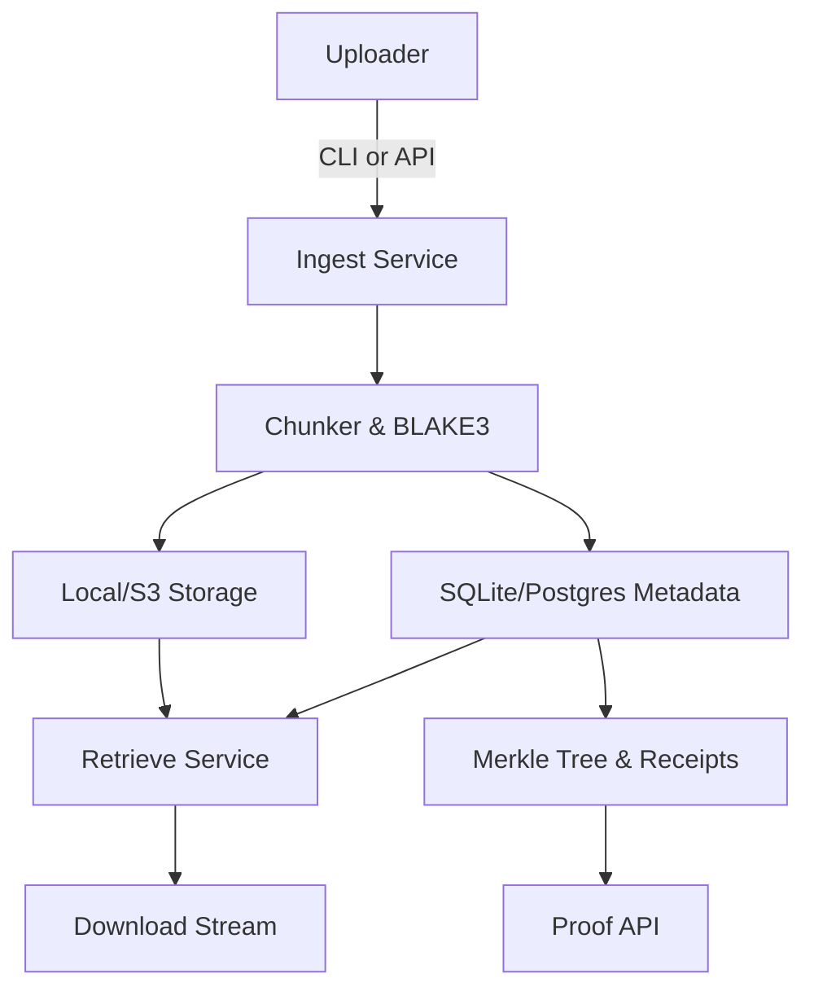

# Vault v1

Vault v1 is a runnable, minimal-but-real content-addressable storage service with fixed-size chunking, Merkle proofs, and optional ES256 receipts. The stack is Python 3.11 with FastAPI, SQLite (switchable to PostgreSQL), and pluggable storage backends (local filesystem and S3).

## Features

- Content-addressable ingestion with BLAKE3 chunking and deduplication.
- Configurable chunk size (default 1 MiB).
- Merkle proofs and receipts for both ingestion and retrieval.
- FastAPI HTTP API, Click-based CLI, and pluggable storage backends.
- Optional ES256 receipts signed with keys created via `vault keygen`.
- SQLite by default with easy DATABASE_URL override for PostgreSQL.
- Dockerfile and docker-compose for containerised deployments.
- GitHub Actions workflow running Ruff lint and pytest.
- Reproducibility target that verifies dependency and tree hashes.

## Installation

### Prerequisites

- Python 3.11
- `make`
- `pip`

### Local setup

```bash
cd vault_v1
make dev
```

The `make dev` target creates a virtual environment, installs dependencies, and applies the schema migrations.

### Running the API locally

```bash
make api
```

This launches uvicorn on `http://0.0.0.0:8080`.

### Docker

```bash
cd vault_v1
docker compose up --build
```

The compose file maps port `8080` and mounts `./data` to `/data` for chunk storage and `./keys` for signing keys.

## Configuration

Environment variables (see `.env.example`):

| Variable | Default | Description |
| --- | --- | --- |
| `DATABASE_URL` | `sqlite:///vault.db` | Database connection string. |
| `VAULT_BACKEND` | `local` | Storage backend (`local` or `s3`). |
| `VAULT_LOCAL_PATH` | `./data` | Path for local chunk storage. |
| `VAULT_S3_BUCKET` | `vault-bucket` | S3 bucket when using the S3 backend. |
| `AWS_ACCESS_KEY_ID` | – | AWS credential for S3. |
| `AWS_SECRET_ACCESS_KEY` | – | AWS credential for S3. |
| `AWS_DEFAULT_REGION` | `us-east-1` | AWS region for S3. |
| `VAULT_SIGNING_KEY` | `keys/signing.json` | Path to ES256 JWK for receipts. |
| `CHUNK_SIZE` | `1048576` | Default chunk size in bytes. |

## API Usage

### Health check

```bash
curl http://localhost:8080/healthz
```

### Ingest file

```bash
curl -X POST \
  -F "file=@example.txt" \
  "http://localhost:8080/v1/files/?chunk_size=524288&sign=true"
```

Response:

```json
{
  "cid": "...",
  "total_size": 1234,
  "chunk_count": 3,
  "merkle_root": "...",
  "receipt": {
    "payload": {"cid": "...", "total_size": 1234, "merkle_root": "...", "receipt_type": "ingest", "created_at": "..."},
    "signature": "eyJ..."
  }
}
```

### Download file

```bash
curl -o restored.bin "http://localhost:8080/v1/files/{CID}"
```

### Fetch proof

```bash
curl "http://localhost:8080/v1/files/{CID}/proof"
```

Response contains Merkle root, chunk hashes, and (optionally) receipt.

## CLI Usage

```bash
# Generate signing key
vault keygen --out keys/signing.json

# Ingest a file with receipts
vault ingest ./example.txt --chunk-size 524288 --sign

# Fetch by CID
vault fetch <CID> --out ./restored.txt

# Display proof
vault proof <CID>
```

## Architecture



## Why BLAKE3 + Merkle Trees?

BLAKE3 offers high throughput, keyed hashing options, and extensibility with minimal CPU usage, making it ideal for deduplicating chunks in high-volume ingest pipelines. Merkle trees allow us to compress chunk integrity into a single root hash, enabling lightweight proofs that any retrieved chunk set matches what was ingested without re-transferring the entire file.

## Tests & CI

Run the test suite:

```bash
make test
```

Reproducibility check:

```bash
make reproducible
```

## Acceptance Checklist

The following commands validate a full end-to-end flow:

```bash
make dev
make test
make api &
curl -sf http://localhost:8080/healthz
curl -sfL -F "file=@README.md" "http://localhost:8080/v1/files/?sign=true" > /tmp/ingest.json
CID=$(jq -r '.cid' /tmp/ingest.json)
curl -sf "http://localhost:8080/v1/files/$CID/proof" | jq '.'
```

Ensure these steps complete successfully before promoting a build.
